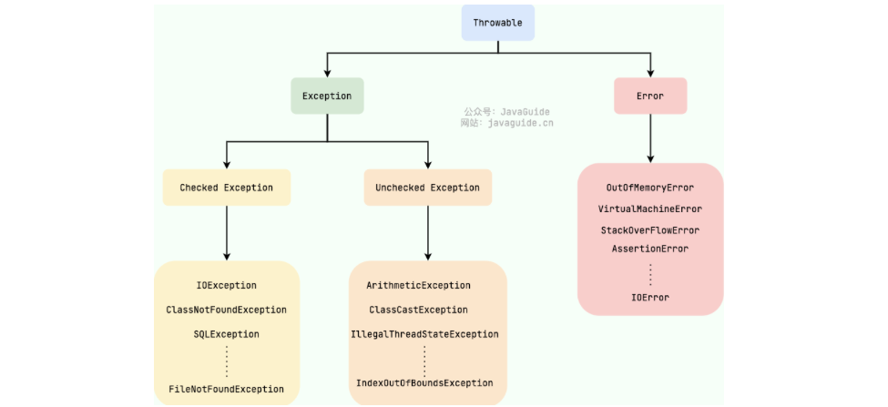

### 异常体系



Throwable 是 Java 异常体系的根类（继承于 Object)，所有可被抛出的对象都必须继承它。它有两个直接子类：Error 和 Exception。

+ Error：表示 JVM 层面的严重错误，程序无法恢复。不需要也不应该捕获。像是内存溢出、栈溢出、类加载失败。
- Exception：程序本身可以处理的异常，可以通过 catch 捕获。
    - Checked Exception：受检异常。编译期强制检查，必须用 try-catch 捕获或用 throws 声明。表示"程序逻辑本身没错，但外部条件可能导致失败"。像是文件不存在、网络不通、数据库连接失败。
    - Unchecked Exception（RuntimeException）：运行时异常。编译期不强制处理，运行时才抛出。表示"代码本身有 bug"，应该修复代码而不是捕获。像是空指针、数组越界、类型转换错误。
##### Throwable 为什么要分两类呢？
Error 代表了严重错误，通常是由 JVM层面或底层资源导致的。一旦发生 Error，程序不应该试图去捕获它，尽管技术上可以 catch，但这是极坏的实践。比如内存溢出时，catch 里做任何操作都可能需要内存，陷入死循环；栈溢出时，执行 catch 本身也需要栈空间，可能直接无法执行。总之 Error 发生时，JVM 内部状态已经不可靠，继续运行可能产生不可预期的行为。
Exception 代表程序可以预见并处理的异常情况，分为两类：外部环境导致的（如文件不存在、网络中断），程序逻辑 bug 导致的（如空指针、数组越界）。前者可以通过重试、降级等方式恢复，后者应该修复代码而非捕获。
所以主要的点，是发生后能不能“**恢复**”的问题。
##### Exception 为什么要分两类呢？
核心初衷是为了在代码的健壮性与开发效率之间取得平衡。 Checked Exception 表示"程序逻辑本身没错，但外部条件可能导致失败"，设计者认为这些问题是无法避免的，一定可能会发生的，调用者就必须有应对方案（要么捕获处理，要么声明抛出让上层处理），从而保证程序的稳健性。
Unchecked Exception 表示"代码本身有 bug"，这些错误本该通过改进代码逻辑来避免解决的。如果把它们也设为受检异常，代码中将到处充斥着 try-catch 或 throws 声明，极大地增加重复冗长的代码。
所以主要的点，是能不能“**避免**”的问题。在实现自定义异常时，到底继承 RuntimeException 还是 Exception 可以考虑这个点。
### Throwable 类常用方法有哪些？
- `String getMessage()`：仅返回异常的描述信息。
- `String toString()`：返回异常的类名和简短描述信息。
- `void printStackTrace()`：打印完整的异常堆栈信息。
```java
try {
    int result = 10 / 0;
} catch (ArithmeticException e) {
    e.getMessage();  // "/ by zero"
    e.toString();  // "java.lang.ArithmeticException: / by zero"
    e.printStackTrace();
    // java.lang.ArithmeticException: / by zero
    //   at com.example.Main.main(Main.java:3)
}
```
### 常见 Exception
```
LinkageError（链接错误的父类）
├── NoClassDefFoundError     ← 找不到类定义
├── NoSuchMethodError        ← 找不到方法
├── NoSuchFieldError         ← 找不到字段
├── IncompatibleClassChangeError ← 类结构不兼容
│   └── AbstractMethodError  ← 抽象方法未实现
└── VerifyError              ← 字节码校验失败

ClassNotFoundException（注意：这个是 Exception，不是 Error）
```
#### 如何处理异常
1）try-catch-finally
```java
try {
    // 可能抛异常的代码
} catch (IOException e) {
    // 处理特定异常
} catch (Exception e) {
    // 兜底处理
} finally {
    // 无论是否异常都会执行（资源清理）
    // 当在try或catch中遇到return语句时，finally中的语句将在方法返回之前被执行
}
// 注意：当try语句和finally语句中都有return语句时，try语句块中的return语句会被忽略。这是因为try语句中的return返回值会先被暂存在一个本地变量中，当执行到finally语句中的return之后，这个本地变量的值就变为了finally语句中的return返回值
```
2）throws / throw（向上抛出）
```java
// throws：声明方法可能抛出异常，让调用方负责处理
public void loadConfig() throws IOException {
    FileReader reader = new FileReader("config.txt");
}

// throw：主动抛出一个异常实例
public void setSpeed(int speed) {
    if (speed < 0) {
        throw new IllegalArgumentException("速度不能为负数：" + speed);
    }
}
```
3）try-with-resources

```java
// 自动关闭实现了AutoCloseable的资源
try (FileReader reader = new FileReader("file.txt")) {
    // 使用reader
} // 自动调用reader.close()
```
#### 自定义异常
```java
public class DriveModeException extends RuntimeException {
    public DriveModeException(String message) {
        super(message);
    }

    public DriveModeException(String message, Throwable cause) {
        super(message, cause);
    }
}
```
#### finally 中的代码一定会执行吗？
绝大多数情况下会，包括 try 或 catch 中有 return 时，finally 也会在方法返回之前执行。但有三种情况不会执行：
+ `System.exit()`：程序直接终止，JVM 立即关闭，不再执行任何代码。
+ 线程被强制终止：如 `Thread.stop()`，线程被立即杀死。
+ JVM 崩溃 — 如 Error 导致 JVM 进程本身崩溃，来不及执行 finally。


