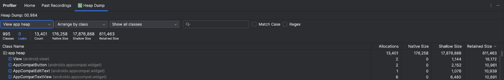

#### Heap Dump

Heap Dump（内存快照）
Heap Dump 是对堆内存的瞬时快照，已被 GC 回收的对象根本不存在于快照中。

在 Memory Profiler 里点 Record 开始录制，它会在一段时间内追踪每一次 new 操作。

>  https://developer.android.com/studio/profile/capture-heap-dump?hl=zh-cn

Allocations

+ 该类在当前内存堆中一共创建过多少个实例对象。

+ 例如 Allocations = 1500 表示该类被 new 了 1500 次，这是录制期间所有被创建的对象数量，不管它后来有没有被 GC 回收。

+ 如果一个不应该有很多实例的类（例如 Activity、Fragment、ViewModel、Repository、UseCase、Adapter、Listener、BroadcastReceiver、ContentObserver 等），其 Allocations 显示为 5，通常意味着发生了内存泄漏（前 4 个页面经历 `onDestroy()` 销毁后未被 GC 回收）。

  

那这么说，没啥参考意义了？因为可能已经被回收了？

在 Heap Dump 中，它反映的是当前存活的实例数量。
关注场景：某个类的 Allocations 异常高，可能存在对象泄漏或过度创建（比如在 onDraw() 里频繁 new Paint()）。

Native Size

+ 该 Java 对象在底层 C/C++（Native）层分配并关联的内存大小。
+ 比如 Bitmap：Java 层仅仅是一个轻量级的 Bitmap 外壳（Shallow Size 很小），真实的像素矩阵（如一张 4K 图片的几兆甚至几十兆像素数据）直接存放在 Native 内存中。
+ 以字节为单位

Shallow Size

+ 该对象**本身**在 JVM 堆内存中所占用的字节大小，**不包含**它引用的其他对象。
+ 对于常规 Java/Kotlin 对象，这个值通常很小（一般只有十几到几十字节），只包含对象头（Object Header）和自身的基本类型字段（如 `int`、`boolean` 等）以及引用指针本身的体积（4/8 字节）。
+ 以字节为单位

Retained Size

+ 如果**彻底回收/销毁**这个对象，系统总共能**释放**出多少内存。
+ `Retained Size` = 自身大小（Shallow + Native） + **仅被该对象持有引用的所有下游对象的总大小**（即支配树 Dominator Tree 中属于它的子树）。
+ 注意：如果某个下游对象同时被其他根节点（GC Root）引用，则不会算进当前对象的 Retained Size 里，因为即使回收了当前对象，那个下游对象依然不能被 GC 回收。
+ **排查内存占用与泄露的最关键指标**。如果一个 `Activity` 泄漏了，看它的 `Retained Size` 就能直观知道它阻止了多少兆内存的释放。
+ 以字节为单位

### 