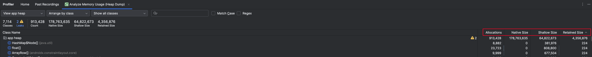
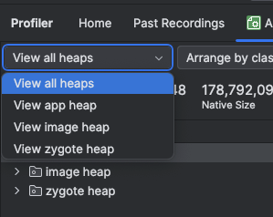
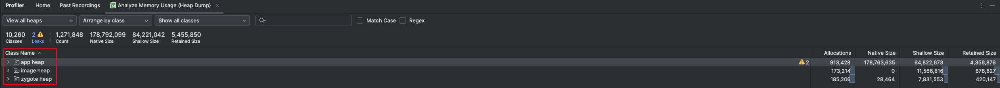
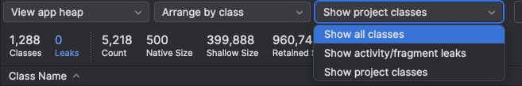
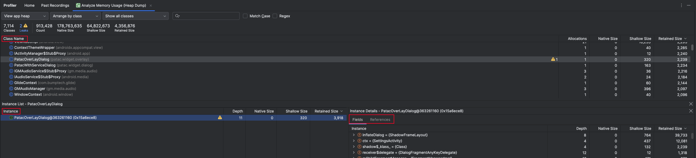
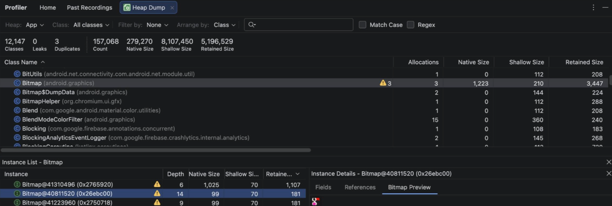

#### Heap Dump（.hprof）

Heap Dump 是 Java/Android 虚拟机在某一时刻把整个堆内存（Heap）中的对象状态完整序列化到磁盘的文件，文件扩展名为 .hprof（Heap Profile 的缩写）。简单来说就是堆内存的瞬时快照，已被 GC 回收的对象不会存在于快照中（所有尚未被 GC 实际回收的对象都会出现在快照中，包括那些已经不可达但 GC 还未来得及清理的"垃圾"对象）。

有什么作用呢？

+ 定位内存泄漏：通过分析 Heap Dump，你可以看到哪些本该被销毁的对象（如已经销毁的 Activity）依然驻留在内存中。
+ 分析内存溢出（OOM——OutOfMemoryError）：在崩溃前夕或模拟出高内存压力时抓取 Heap Dump，可以清晰地看到是谁占用了绝大部分内存。能是加载了过大的图片（Bitmap）、缓存了过多的数据（Cache）或者创建了成千上万个小对象。
+ 优化内存占用
  + 查找冗余对象：比如内存中存在大量重复的字符串或重复生成的相同对象。
  + 发现异常的大对象：识别出占用空间异常大的数据结构或集合类。
  + 减少内存压力：识别出那些长期占用内存但使用频率极低的对象，改为按需加载或弱引用。
+ 解决应用卡顿：如果应用频繁触发垃圾回收（GC），会导致 UI 线程被频繁暂停，造成视觉上的卡顿。通过 Heap Dump 配合 “Java/Kotlin Allocations”，可以发现哪些代码在短时间内产生了大量短生命周期的小对象。减少这些分配可以减轻 GC 的压力，让应用更流畅。

如何抓取呢？

+ 通过 Android Studio Profiler 中 “Heap Dump” 工具，点击 “Start Recording” 即可获得快照。

+ 也可以通过 adb 命令 `adb shell am dumpheap <pid> /data/local/tmp/heap.hprof`，注意这需要 Debug 版本的包。

+ 代码中主动触发，也需要 Debug 版本的包。

  ```java
  import android.os.Debug;
  Debug.dumpHprofData("/sdcard/Download/heap.hprof");
  ```

+ 引入 LeakCanary，`debugImplementation 'com.squareup.leakcanary:leakcanary-android:2.14'`，当检测到已销毁的 Activity 或 Fragment 在 5 秒后仍未被回收时，LeakCanary 会自动触发 `Debug.dumpHprofData()` 抓取快照，并使用内置的 Shark 解析器直接输出泄漏的引用链。

注意，在排查内存泄漏时，需要先执行 GC，清除已不可达但尚未被回收的对象，避免对泄漏分析造成干扰。；但排查 OOM 崩溃、分析高频临时分配等，不需要手动 GC。

==贴个图片 Profiler 怎么 GC==

#### Profiler 分析 Heap Dump

>  https://developer.android.com/studio/profile/capture-heap-dump?hl=zh-cn



Allocations

+ 表示当前堆中**该类**的存活**实例数量**。
+ 如果一个不应该有很多实例的类，比如一个 Activity 的 Allocations 显示为 5，看到 Activity 数量 > 1 几乎可以断定有泄漏（前 4 个页面经历 `onDestroy()` 销毁后未被 GC 回收），有引用链在阻止它们被回收。

Shallow Size

+ 该类的对象实例本身在 JVM 堆内存中所占用的字节大小，不包含它引用的其他对象。
+ 对于常规 Java/Kotlin 对象，这个值通常很小（也有很大的，比如 RecyclerView，继承链很深，东西很多），只包含对象头和自身的基本类型字段（如 int、boolean 等）以及引用指针本身的体积。例如一个只含两个 int 字段的对象，Shallow Size 大约是 16（对象头）+ 8（两个 int）= 24 字节左右。
+ 但它并不反映对象的真实内存状况，因为大部分对象都会引用其它对象。
+ 同一个类的所有实例，其 Shallow Size 是一模一样的。但对于数组，它的 Shallow Size 取决于数组长度。但普通对象（如List、User 对象）的 Shallow Size 通常只有 24 - 40 字节（List 里面都是引用，所以不会影响 Shallow Size；但引用特别的多的话，Retained Size 可能会很大）。

Native Size

+ 表示该类的对象实例在 Native 堆（C/C++ 层） 中占用的内存字节数。
+ Java 对象本身在 JVM 堆中占的内存不大，但部分特定类型的对象会在底层通过 Native 代码分配额外的内存，且这部分内存可能远大于对象本身的 Shallow Size。
+ 日常开发中，95% 以上的对象都没有 Native 内存开销，可能会遇到的如下：
  + Bitmap：Java 层仅仅是一个轻量级的 Bitmap 外壳（Shallow Size 很小，可能只有几十字节），真实的像素矩阵会存放在 Native 内存中，会达到 MB 级。
  + Paint / Canvas / Path：绘图相关，底层都是 Skia 图形引擎的 C++ 对象，每个都有对应的 Native 内存。
  + MediaPlayer / ExoPlayer：音视频解码缓冲区、解码器实例都在 Native 层。
  + DirectByteBuffer：NIO。
  + Surface / SurfaceView / TextureView：图形缓冲区（GraphicBuffer）分配在 Native 层。
  + SQLiteDatabase / Cursor：SQLite 引擎是纯 C 实现，查询结果缓存在 Native 内存。
  + WebView：整个浏览器内核（Chromium）在 Native 层，一个 WebView 可能占 几十 MB 的 Native 内存。

Retained Size

+ 表示如果彻底回收/销毁这个类所有对象实例，系统总共能释放出多少字节内存。
+ Retained Size = 自身大小（Shallow Size + Native Size） + 该对象独占的所有对象的 Shallow Size、Native Size 之和（“独占引用”，如果某个子对象只有这一条引用链能到达，那它算独占；如果有其它路径也能到达该子对象，则不算）。
+ **这是判断内存影响最重要的指标。**当发现内存占用高时，永远先看 Retained Size 的倒序排列，解决 Retained Size 最大的那个对象，通常能产生“立竿见影”的效果。比如一个 Activity 实例的 Retained Size 是 20MB，说明如果它被泄漏，就会白白占住 20MB 内存。总之 Retained Size 越大，泄漏危害会越大。





+ app heap：对于 APP 开发者唯一需要关注的。你的应用在运行期间，自己通过代码 new 出来、业务逻辑所产生的所有对象。下面呢俩是给 Android 系统底层工程师、Framework 定制开发人员（如车载车机/手机厂商 ROM 团队）
+ image heap：系统编译期提前固化好的只读类与核心对象镜像，随开机直接映射到内存，所有进程共享且 GC 永远不会回收。
+ zygote heap：系统开机时 Zygote 进程预加载的框架层资源，App 启动时直接通过写时复制（COW）机制继承并默认共享。



+ Show all classes：展示当前堆内存中所有的类，不做任何过滤。你的业务代码、第三方开源库、系统 Framework 类、JDK 基础类（`java.*`）等全部在列。
+ Show activity/fragment leaks：仅显示泄漏的 Activity/Fragment。Profiler 会自动运行检测算法，找出生命周期已经执行了 `onDestroy()`（即页面已销毁），但在堆中依然被强引用无法被 GC 回收的 Activity 或 Fragment 实例。只列出被系统判定为已经泄漏的 UI 组件类（带黄色感叹号警告）。
+ Show project classes：仅显示当前工程的类，自动过滤掉系统的 SDK 类（`android.*`、`java.*`）和第三方依赖库，只留下你自己的包名下的类。



这个上方是“类”，点击后，下面会显示出该类的所有“实例”。

+ Depth：GC 引用深度，从系统中最顶级的“根节点（GC Root，例如栈变量、静态变量、JNI 全局引用）”出发，经过几层引用指针才能找到当前这个对象。

  ```
  GC Root（线程栈）
    └── Activity           ← Depth 1
          └── ViewGroup    ← Depth 2
                └── View   ← Depth 3
                      └── Listener ← Depth 4
  ```

+ Native Size、Shallow Size、Retained Size：同上，这个是单实例的大小

+ Fields：（向下看）表示这个类有哪些字段，以及每个字段的值。

+ References：（向上看）展示在内存中谁持有了当前对象的引用，并一路向上追溯到系统最顶级的根节点（GC Root）。

+ Show nearest GC root only：勾选代表只显示到最近 GC Root 的最短路径；不勾选代表显示所有引用这个对象的路径，一个对象在复杂的 Android 系统中可能被几十个地方间接弱引用或引用，如果不勾选，References 树会极其庞大繁杂。


虽然它**绝不会漏掉“这个对象发生泄漏”的事实**，但在实际定位原因时，它展示出来的引用链**不一定是你代码里写出的那个错误点**。

如果是独立的单例/缓存泄漏，需要开发者结合 **`Allocations` 数量异常膨胀** 或 **`Retained Size` 过大** 自行排查。


#### 检测重复的 BitMap

目前 Profiler 的重复检测功能只针对 Bitmap。因为 Bitmap 是 Android 中最容易出现重复加载的对象，且单个实例的 Native 内存占用大，重复时的浪费也最为显著。



#### 查找内存泄漏

Profiler 检测内存泄漏的原理

+ 遍历堆中所有对象，筛选出 Activity 和 Fragment 的子类实例。
+ 通过检查内部标志位，判断哪些已经被"销毁"。Activity，检查 mDestroyed 字段是否为 true；Fragment，检查 mLifecycleRegistry 的当前状态是否为 DESTROYED。如果已标记销毁，说明 `onDestroy()` 已经执行过了，按理说应该被 GC 回收。
+ 既然 `onDestroy()` 已经执行了，这个对象就应该被 GC 回收。如果它仍然出现在 Heap Dump 里，说明有引用链在阻止它被回收，就会判定为泄漏。

但是像 Service、BroadcastReceiver 、Overlay 等泄漏，Profiler 是检测不出来的。因为这些没有明确的生命周期结束时间。

**内存泄漏的危害**


#### Java/Kotlin Allocations

在 Memory Profiler 里点 Record 开始录制，它会在一段时间内追踪每一次 new 操作。


是的，在 Android Studio **Profiler** 中完全可以看到这两个指标，但它们在界面上的**列名（Labels）**可能和你用的术语稍有不同。

当你使用 **"Record Java/Kotlin allocations"**（记录内存分配）功能，并选择一段特定的时间范围（Timeline Range）后，下方的表格会列出以下关键信息：

1. Total Allocations (在 Profiler 中显示为 **Allocations**)

- **对应列名：** Allocations
- **含义：** 表示在你选定的这一段时间内，该类**总共被创建（实例化）了多少次**。
- **分析意义：** 它是累计值。如果这个数值很大，即使当前存活的对象很少，也说明代码中存在**“内存抖动”**（Memory Churn）。比如你在 onDraw 或循环里频繁创建对象，会导致这个值飞涨，从而触发频繁的 GC，造成界面卡顿。

2. Live Allocations (在 Profiler 中显示为 **Total Count**)

- **对应列名：** Total Count
- **含义：** 表示在当前选定时间段的**终点时刻**，该类有多少个实例**依然存活在堆中**。
- **计算公式：** Total Count = 记录前的存活数 + 新分配(Allocations) - 已回收(Deallocations)。
- **分析意义：** 这是判断**内存泄漏**的核心指标。如果你反复操作某个页面（例如进出 Activity 5 次），发现该 Activity 的 Total Count 变成了 5，那就说明发生了泄漏。


在哪里查看？

在 Android Studio Profiler 的 **Memory** 面板中，根据你的操作模式，看到的内容会有细微差别：

1. **录制模式 (Record Java/Kotlin Allocations)：**你可以同时看到 **Allocations** (总分配数)、**Deallocations** (回收数) 和 **Total Count** (当前存活数)。这是观察对象“生命周期动态”的最佳方式。
2. **堆转储模式 (Capture Heap Dump)：**主要显示的是 **Allocations** 或 **Instance Count**。因为 Heap Dump 是一个“瞬间的快照”，所以此时看到的 Allocations 实际上指的就是**当前存活的实例数量**（即 Live Allocations）。

总结对照表：

| 你的术语              | Profiler 对应列名 | 关注点             | 理想状态                       |
| --------------------- | ----------------- | ------------------ | ------------------------------ |
| **Total Allocations** | **Allocations**   | 内存抖动、GC 压力  | 数值平稳，不应随短时间操作剧增 |
| **Live Allocations**  | **Total Count**   | 内存泄漏、内存占用 | 操作结束后，该值应回到初始状态 |

分析**内存泄漏**时，重点看 **Total Count**（存活数）；
分析**运行卡顿**时，重点看 **Allocations**（总分配频率）。


#### Native Allocations


#### 什么时候用静态变量、静态方法
用在全局唯一、无状态的场景，比较常见的场景：
- 常量
- 工具类方法
- 单例模式
###### 比如 Fragment 里面的东西为啥不用 static
首先，这些类里的 Tag 都是用 static 声明的，因为它和具体某个 Fragment 实例无关，所有的对象都有这个值，是共用的，所以声明为 static。
一方面，假设你有两个 Fragment 实例，一个显示用户A，一个显示用户B，这是有状态的，肯定不能 static。
另一方面，那生命周期完全没有意义了，static 只有在对应 Class 释放时才会被释放，而后者这有进程结束时才会被释放。这样会导致内存泄漏。
###### 常量、工具类方法这些一直不释放不算内存泄漏吗？
内存泄漏的核心定义是：程序中已动态分配的堆内存，由于某种原因，程序**无法释放**或**不再需要**这块内存，但却无法被垃圾回收器回收，导致内存被白白占用，最终可能引发内存溢出。
但对于 static，是**符合预期**的行为。程序员在声明一个 `static Map` 时，就是希望它作为一个全局缓存，在整个程序运行期间都存在。它的存在是“必需的”，而不是“无用的、无法释放的垃圾”。
但是，误用 static 变量是造成 Java 内存泄漏最常见的原因之一，比如你声明了一个 `static Map`，你一直往里面 `add` 东西，有些东西其实已经不用了，但你还不删除，这就会造成内存泄漏。
###### 那这样不占用内存吗？
设置为 static 恰恰是为了更高效、更合理地使用内存，而不是为了避免占用内存。
###### 好处
有两个好处：
- 语义正确性，表达“属于类而非实例”。比如常量 `Math.PI`，它的值是固定不变的，不需要创建 `Math` 对象就能获取，让每个 `Math` 对象都存一份 `PI` 是毫无意义的；比如工具方法 `Arrays.sort()`，这些方法执行的操作不依赖于任何对象实例的状态（即不访问非 static 的实例变量），它们只依赖于传入的参数。因此，不需要创建对象来调用它们，直接通过类名调用最为合理。
- 调用便利性：无需实例化，直接调用。通过类名直接访问，代码非常简洁清晰，避免了繁琐且无意义的`new`操作。


**内存泄漏**：
在程序运行期间，**不再被使用的内存无法被回收**，导致内存占用不断增加，像是使用 static 修饰的集合、**未关闭文件流**等。


#### 方法提供内提供至 null 避免内存泄漏的场景
> 不是很明白，日后再看
public class TabNavigationAction extends VehicleAction {  
​  
    private NavigationListener mNavigationListener;  
    private String mValue;  
​  
    public void setNavigationListener(@NonNull final NavigationListener navigationListener) {  
        mNavigationListener = navigationListener;  
        if (mKeyStr != null) {  
            mNavigationListener.navigate(mValue, mValue);  
        }  
    }  
​  
    public void deleteListener() {  
        mNavigationListener = null;  
        mValue = null;  
    }  
​  
    public interface NavigationListener {  
        public String navigate(String key, String value);  
    }  
}  
​  
​  
public class IntelligentDeviceViewModel extends BaseViewModel {  
    public void registerNavigationListener(final NavigationHandleListener handleListener) {  
        final TabNavigationAction action = getNavigationAction();  
        if (action != null) {  
            action.setNavigationListener(handleListener::navigateHandle);  
        }  
    }  
​  
    // 可以看作等同于NavigationListener  
    public interface NavigationHandleListener {  
        String navigateHandle(@NonNull String key, String value);  
    }  
​  
​  
    private void unRegisterNavigationListener() {  
        final TabNavigationAction action = getNavigationAction();  
        if (action != null) {  
            action.deleteListener();  
        }  
        LogUtils.getInstance().d(TAG, "unRegisterNavigationListener");  
    }  
​  
​  
    @Override  
    public void onCleared() {  
        LogUtils.getInstance().d(TAG, "onCleared");  
        super.onCleared();  
        mDisposables.clear();  
        mRegisterPowerObserUseCase.clear();  
        mOffOperationHandler.removeCallbacksAndMessages(null);  
​  
        unRegisterNavigationListener();  
    }  
}  
​  
​  
public class IntelligentDeviceFragment extends BaseThemeFragment<IntelligentDeviceViewModel> {  
    // 内部类会引用外部类，也就是IntelligentDeviceFragment  
    getViewModel().registerNavigationListener((key, value) -> {  
         LogUtils.getInstance().d(TAG, "页面导航 key = " + key + ", 处理界面--->" + value);  
         String reply = Header.Reply.UN_SUPPORT;  
         if (TextUtils.equals(key, ConstantValue.FUNC_TYPE_SMART_DEVICES)) {  
             // 这里引用了IntelligentDeviceFragment的元素  
             reply = handleVrCommand(mFridgeSwitchLayout);  
         } else if (TextUtils.equals(key, ConstantValue.FUNC_TYPE_SMART_DEVICES_MODE)) {  
             reply = handleVrCommand(mFridgeRecyclerView);  
         }  
         return reply;  
    });  
}

IntelligentDeviceFragment → “IntelligentDeviceViewModel” → TabNavigationAction → NavigationHandleListener  
        ↑                                                                                 ↓   
        ---------------------------------------------------------------------------------->  
    
IntelligentDeviceViewModel → TabNavigationAction → NavigationHandleListener → IntelligentDeviceFragment  
    
    
ViewModel (存活)    
  ↓    
TabNavigationAction    
  ↓    
NavigationListener (lambda)    
  ↓    
Fragment (被 lambda 引用)    
  ↓    
ViewModel (Fragment 持有 ViewModel)    
    
    
    
可能：  
GC Roots  
  ↓  
ActivityThread  
  ↓  
Activity  
  ↓  
FragmentManager  
  ↓  
Fragment  
  ↓  
ViewModelStore（Fragment 的成员）  
  ↓  
ViewModel（持有 lambda）  
  ↓  
lambda（捕获 Fragment）形成闭环

为什么要提供 `deleteListener()`？

因为这里这里有一个循环引用，不受冻至 null，就无法被 GC 回收。

我在想当 Fragment 或 ViewModel 生命周期结束时，这个循环引用不就打破了吗？

当 Fragment 生命周期已经结束，也就是“上面”已经没有东西引用它了，按理应该被 GC 回收，但这里的 listener 还持有对 Fragment 的强引用，GC 可能通过别的路径比如 ViewModel 最终到达 Fragment ，那么 GC 就认为 Fragment 仍“可达”，不能回收，这就导致了内存泄漏。（别去想了）