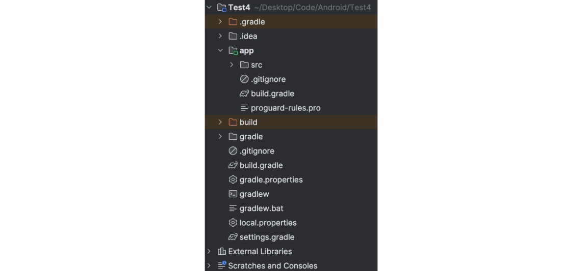
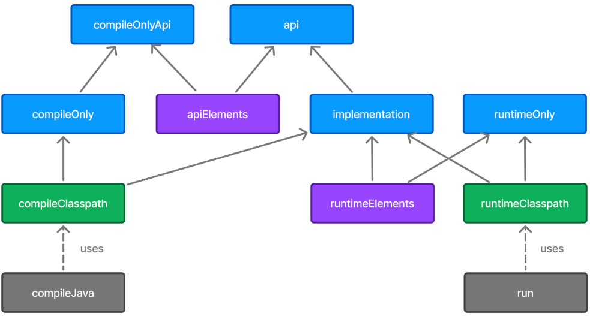
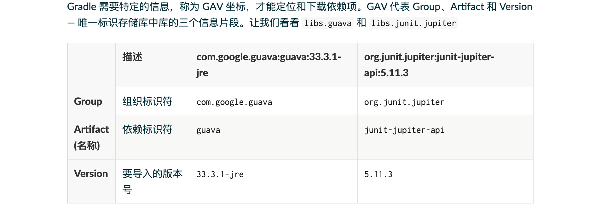

> https://docs.gradle.org/current/userguide/userguide.html

### 简介

首先，用两个单词形容它是什么，它是一个 Build Tool。和其它构建工具的区别：

**1）Ant**

Apache Ant 是一种基于 XML 的构建工具，通过 build.xml 定义编译、打包、部署等 task。缺点：无依赖管理能力，需手动管理 JAR 包；XML 冗长、可读性差，构建逻辑难以复用；无标准生命周期和项目结构约定，维护成本高。现已过时。

**2）Maven**

Apache Maven 是一种基于 POM（pom.xml）的项目管理和构建工具，核心理念是**约定大于配置**，提供标准的项目结构（源代码必须在 `src/main/java` 下、资源在 `src/main/resources` 下，测试在 `src/test/java` 下）和构建生命周期（clean → compile → test → package → install → deploy）。原生支持依赖管理，通过坐标（groupId:artifactId:version）自动从中央仓库下载依赖并处理传递依赖。缺点：XML 配置仍然冗长；构建流程固定、灵活性不足，复杂自定义构建场景写起来笨重；大型多模块项目构建速度较慢。后被 Gradle 在灵活性和性能上超越，但在传统 Java 后端项目中仍广泛使用。

**3）Gradle**

Gradle 旨在结合 Ant 的灵活性和 Maven 的依赖管理与项目结构约定。使用 Groovy 或 Kotlin 编写构建脚本，相比 XML 具有更高可读性，定制构建逻辑更简洁强大。完全兼容 Maven 仓库和依赖管理机制，同时采用标准化的项目目录结构。性能方面，引入增量构建（仅编译变更部分）、构建缓存和并行构建，在三者中最优。

**总结**

+ Ant = 构建（无依赖管理）
+ Maven = 构建 + 依赖管理（标准生命周期，约定大于配置，灵活性一般）
+ Gradle = 构建 + 依赖管理 + 可编程脚本（兼具两者优点，性能更强）

### 常用命令

下面都会降到，这里做一个汇总，方便查阅：

bash，地址

+  `./gradlew assembleDebug`：构建所有渠道的 Debug 变体。也可以，构建指定渠道的 Debug 变体，比如有 local8155 渠道，则 `./gradlew assemblelocal8155Debug`。
+ `./gradlew clean`：清理编译缓存。经常重复编译就会报错，可能是有些缓存冲突，需要用到这个。
+ `./gradlew test`：运行所有模块的单元测试。
+ `./gradlew :drive:dependencies`：查看 Drive 模块的依赖树。
+ `./gradlew :domain:publishToMavenLocal`：将 domain 模块的构建产物发布到本地 Maven 仓库（~/.m2/repository/），本地其它项目只需配置 `mavenLocal()` 即可直接引用，无需发布到远程 Maven 仓库。


```
./gradlew build
```


### Gradle 原生

#### 目录结构



```
MyProject/
├── settings.gradle          ← 声明包含哪些模块
├── build.gradle             ← 项目级（根）
├── app/
│   └── build.gradle         ← 模块级
└── lib/
    └── build.gradle         ← 模块级
```

**1）`.gradle`**

它是 Gradle 构建系统生成的缓存目录。当你构建项目时，Gradle 会下载各种第三方库（jar 包、aar 包），为了避免每次编译都重新下载，它会把这些文件缓存由于此。还会记录上一次构建的状态，如果你没有修改代码，Gradle 就会直接跳过某些编译步骤，从而加快编译速度。

**2）项目级 `build.gradle`**

```groovy
// 插件版本声明，apply false表示只声明版本不应用，子模块里再apply
plugins {
    id 'com.android.application' version '8.0.0' apply false
    id 'com.android.library' version '8.0.0' apply false
}

// 共享配置（根项目 + 所有子项目）（已经过时）
allprojects {
    group = 'com.mycompany'  // GAV坐标中的G和V
    version = '1.0.0'
}

// 共享配置（只包含子项目，不含根项目）（已经过时）
subprojects {
    // 声明依赖从哪里下载
    repositories {
        google()       // 先找Google仓库
        mavenCentral() // Google没有再找Maven Central
    }
}

// 当一个子模块应用了com.android.application或com.android.library插件时，Android插件会自动给该子模块生成一个叫clean的任务（用于删除子模块自身的app/build目录）
// 但是，根工程默认没有应用任何构建插件，因此根工程默认没有clean任务；如果不手动注册这个任务，在命令行执行./gradlew clean时，Gradle会在根工程阶段直接报错
tasks.register('clean', Delete) {
    delete rootProject.layout.buildDirectory
}
```

为什么不把 `android{}` 放入根 build.gradle，让子项目继承？

各个子项目应该是独立的，这样做破坏了各模块的独立性（一个 project 是可以有多个 com.android.application、com.android.library 的，需要额外添加各种逻辑判断）。另外，这也会影响 Configuration Cache，让根项目跨边界修改子项目配置，破坏了项目间的配置隔离，Gradle 无法判断如果只改了子模块的代码，根项目的配置缓存是否还有效，只能放弃缓存全部重配。

**3）模块级 `app/build.gradle`**

```groovy
// 插件声明
plugins {
    id 'com.android.application'   // 或 com.android.library
    id 'org.jetbrains.kotlin.android'
    id 'maven-publish'
}

//  Android配置（AGP提供）
android {
    namespace 'com.mycompany.app'
    compileSdk 34

    defaultConfig {
        applicationId 'com.mycompany.app'   // library 模块没有这个
        minSdk 24
        targetSdk 34
        versionCode 1
        versionName '1.0.0'
    }

    buildTypes {
        release {
            minifyEnabled true
            proguardFiles getDefaultProguardFile('proguard-android-optimize.txt'), 'proguard-rules.pro'
        }
    }

    compileOptions {
        sourceCompatibility JavaVersion.VERSION_17
        targetCompatibility JavaVersion.VERSION_17
    }
}

// 依赖
dependencies {
    implementation 'com.squareup.retrofit2:retrofit:2.9.0'
    implementation 'com.google.code.gson:gson:2.10.1'

    testImplementation 'junit:junit:4.13.2'
    androidTestImplementation 'androidx.test.espresso:espresso-core:3.5.1'
}

// 发布配置
publishing {
    publications {
        release(MavenPublication) {
            groupId = 'com.mycompany'
            artifactId = 'app'
            version = '1.0.0'
            afterEvaluate { from components.release }
        }
    }
}
```

**4）`settings.gradle`**

settings.gradle 是项目的入口文件，告诉 Gradle 项目长什么样，然后 Gradle 才去读每个模块的 build.gradle。

```groovy
// 插件从哪下载（AGP、Kotlin 插件等）
pluginManagement {
    repositories {
        google()
        mavenCentral()
        gradlePluginPortal()
    }
}

// 依赖从哪下载（现在更建议放在settings.gradle里，而不是根build.gradle）
dependencyResolutionManagement {
    repositoriesMode.set(RepositoriesMode.FAIL_ON_PROJECT_REPOS)
    repositories {
        google()
        mavenCentral()
    }
}

// 项目名称，IDE显示的项目名；Gradle构建输出日志会打
rootProject.name = 'MyProject'
// 声明包含哪些模块
include ':app'
include ':lib'
```

**5）`gradle.properties`**

这个文件是全局的 Gradle 配置文件，在这里配置的属性将会影响到项目中所有的 Gradle 编译脚本。

```properties
# JVM内存配置 — Gradle Daemon进程的最大堆内存和编码
org.gradle.jvmargs=-Xmx2048m -Dfile.encoding=UTF-8

# 并行构建 — 多个模块同时编译，大项目提速明显
org.gradle.parallel=true

# Configuration Cache — 缓存配置阶段结果，二次构建极快
org.gradle.configuration-cache=true

# 构建缓存——缓存task产物，未修改的模块跳过编译
org.gradle.caching=true

# 使用AndroidX而非旧Support库，新项目必须开启
android.useAndroidX=true

# R类非传递 — 每个模块只包含自己的资源ID，不继承依赖模块的
# 避免a.png在lib里定义，app里也能R.drawable.a引用到
android.nonTransitiveRClass=true
```

#### 依赖配置

下面这些都是 AGP 提供的依赖配置（Dependency Configuration）方式，用于精确控制依赖在编译期、运行期以及向消费者传递时的行为。

| 配置                | 编译期          | 运行期 | 传递给下游  | 具体例子                                                     |
| :------------------ | :-------------- | :----- | :---------- | :----------------------------------------------------------- |
| api                 | ✅               | ✅      | ✅           | 模块内部用 Gson 解析 JSON，对外公开的方法签名出现了 Gson 类  |
| implementation      | ✅               | ✅      | ❌           | 模块内部用 Gson 解析 JSON，对外公开的方法签名完全不出现 Gson 类 |
| compileOnly         | ✅               | ❌      | ❌           | 车机编译时需要 Framework 的类来编译通过，运行时车机系统自带 Framework，不需要打包进去 |
| compileOnlyApi      | ✅               | ❌      | ✅（编译期） | compileOnly + api                                            |
| runtimeOnly         | ❌               | ✅      | ❌           | 强调编译时完全不需要引用它的类，但最终会被打进最终的 APK；主 App 模块组装业务组件，把各个业务 Module 打包进 APK，自身并不直接调用具体模块的代码（业务间通过路由或接口下沉解耦）；通过反射调用实现类 |
| annotationProcessor | ✅（注解处理器） | ❌      | ❌           | 仅供编译器在编译期间扫描注解并自动生成代码的代码生成器工具，不打入最终产物。比如 lombok |
| testImplementation  | ✅               | ✅      | —           | 用于测试的 implementation                                    |
| testCompileOnly     | ✅               | ❌      | —           | 用于测试的 compileOnly                                       |
| testRuntimeOnly     | ❌               | ✅      | —           | 用于测试的 runtimeOnly                                       |

**1）api**

如果 A api 依赖了 B，那么 C 依赖 A 时，C 的编译 classpath 里会自动带上 B，所以 C 里可以直接使用 B 的 API。

如果 C 已经是最顶层的应用模块（不再被其他人依赖），那此时用 api 还是 implementation 来声明 A 对 B 的依赖，对 C 的最终编译和运行结果没有实质区别。

```
C (应用模块)
└── A (库模块)
    ├── api B          → C 编译时能看到 B
    └── implementation D  → C 编译时看不到 D
```

**api 还是 implementation，取决于该依赖中的类是否出现在本模块的公开接口签名中。出现了就用 api 引入改依赖，没出现就用 implementation。**

**2）我们代码里 Framework 的类为什么要 compileOnly 引入**

这个问题换个问法就是，一个库该不该内置。以下几个考虑的点：

| 考虑点                       | 内置到系统（调用方用 compileOnly）  | 不内置（调用方自己 implementation） |
| :--------------------------- | :---------------------------------- | :---------------------------------- |
| **是不是所有应用都要用？**   | 是 → 内置合理                       | 不是 → 别浪费系统空间               |
| **版本是否需要全系统统一？** | 是 → 必须内置                       | 各应用可能需要不同版本              |
| **库的大小**                 | 很大 → 内置节省整体空间             | 小 → 各自带也无所谓                 |
| **库的更新频率**             | 稳定、很少变 → 适合内置             | 频繁更新 → 各自带更灵活             |
| **是否涉及系统级能力？**     | 是（如车控、蓝牙协议栈） → 必须内置 | 纯业务工具库 → 各自带               |

**3）compileOnly 运行是怎么转换成真实地址的**

implementation 流程：

1. Gradle 下载依赖；
2. 编译时，代码可以引用库里的类；
3. 打包时，库的 class 会被 D8/R8 转成 DEX 并合入 APK；
4. 运行时，PathClassLoader 从你 APK 的 `classes.dex` / `classesN.dex` 中加载类；
5. 不依赖系统或宿主是否预装该库。

compileOnly 流程：

1. Gradle 下载依赖；
2. 编译时，代码可以引用库里的类；
3. 打包时，这个库被排除，不进入 APK；
4. 运行时，ART 要加载这个类时（Android ClassLoader 委派机制）：
   - 先按 ClassLoader 委派链查；
   - 如果系统 Boot ClassLoader 有该类，可能加载成功；
   - 如果宿主、插件框架或其他 ClassLoader 提供该类，也可能成功；
   - 如果哪里都没有，就崩。

**4）compileOnly VS. annotationProcessor**

使用 compileOnly 时，代码里会 import 它的类，让在编译时能够通过，但在运行时使用系统本身自带的该类。而 annotationProcessor，你并不会 import 它的类，它在编译期的作用是帮你生成代码，编译完就完事了，没有运行期的说法。

```groovy
dependencies {
    compileOnly 'org.projectlombok:lombok:1.18.30'          // 代码里用@Data等注解，compileOnly让编译器认识@Data、@Builder这些注解
    annotationProcessor 'org.projectlombok:lombok:1.18.30'   // 编译时自动生成getter/setter代码
}
```

为什么不把 annotationProcessor 的逻辑放到 compileOnly 里面？以前是这样的，后来才移出来。为了更好理解它，其实可以叫它“注解处理器”。以前把把注解处理器和普通编译依赖混在一起，职责不清晰。而且分开后的好处还有可以类路径隔离，当只有注解处理器变化时，避免不必要的全量重编译，更好地支持构建缓存和增量编译。

**5）compileClasspath 和 runtimeClasspath**

它俩并不是真正的 path，而是一组依赖的集合，定义了编译时、运行时需要的所有依赖。执行下面的命令，打印出来的是应用的依赖关系图，不是文件路径（通过这些可以获得真实的路径）。

常用命令：

+ 查看某个模块的依赖：`./gradlew :app:dependencies --configuration compileClasspath`
+ 查看依赖冲突（版本被 `->` 修改的）：`./gradlew dependencies --configuration compileClasspath | grep "\->"`
+ 排查某个库为什么被引入：`./gradlew dependencies --configuration compileClasspath | grep okhttp`

```
./gradlew :app:dependencies --configuration debugCompileClasspath

输出如下：

debugCompileClasspath - Compile classpath for /debug.
+--- project :core
|    +--- project :utils
|    |    \--- org.jetbrains.kotlin:kotlin-stdlib:1.9.24 (c)
|    +--- com.squareup.okhttp3:okhttp:4.12.0
|    |    +--- com.squareup.okio:okio:3.6.0
|    |    |    \--- org.jetbrains.kotlin:kotlin-stdlib:1.9.24 (c)
|    |    \--- org.jetbrains.kotlin:kotlin-stdlib:1.9.24 (*)
|    \--- com.google.code.gson:gson:2.10.1
+--- project :network
|    +--- com.squareup.okhttp3:okhttp:4.10.0 -> 4.12.0
|    +--- platform(androidx.compose:compose-bom:2024.01.00) (platform)
|    |    +--- androidx.compose.ui:ui:1.6.0
|    |    +--- androidx.compose.material3:material3:1.2.0
|    |    \--- androidx.compose.foundation:foundation:1.6.0 (*)
|    \--- org.aspectj:aspectjrt:1.8.9
+--- files(/Users/dev/libs/framework.jar)
+--- com.squareup.okhttp3:logging-interceptor:4.11.0 -> 4.12.0
+--- com.example:old-lib:1.0 FAILED
\--- org.jetbrains.kotlin:kotlin-stdlib-jdk8:1.8.0 -> 1.9.23 (c)
     +--- org.jetbrains.kotlin:kotlin-stdlib:1.8.0 -> 1.9.24
     \--- org.jetbrains.kotlin:kotlin-stdlib-jdk7:1.8.0 -> 1.9.23 (c)
```

简单解释下常见的标记：

a. 树形结构符号

```
+--- project :core
|    +--- project :utils         ← 表示core下面还有兄弟
|    \--- com.google.code.gson   ← 表示core的最后一个子依赖
\--- org.jetbrains...jdk8        ← 顶层最后一项
```

b. 版本解析标记

+ `->`：这个依赖原本请求的版本，被 Gradle 最终解析并选成了后面的版本。

+ `(c)`：被 constraints 所约束的版本。它可能影响最终版本，但单独不能证明最终 classpath 一定是 `2.0.0`，可以看 `->` 或直接使用 `./gradlew :app:dependencyInsight --configuration debugCompileClasspath --dependency common`。

  ```
  +--- com.example:feature-sdk:1.0.0
  |    \--- com.example:common:1.0.0 -> 2.0.0
  \--- com.example:common:2.0.0 (c)
  ```

  ```groovy
  dependencies {
      implementation 'com.example:some-lib:1.0'  // some-lib内部依赖了okhttp:3.0
      constraints {
          // 不会引入okhttp，import okhttp3.*会编译报错
          // 只影响被其它库传递进来的 okhttp 的版本
          // 如果传递进来的是3.0 → 拉升到4.12.0
          // 如果传递进来的是5.0 → Gradle默认取高版本，仍是5.0
          implementation('com.squareup.okhttp3:okhttp:4.12.0')
      }
  }
  ```

+ `(*)`：这个依赖的完整依赖子树前面已经打印过了，这里进行省略。

c. 异常/状态标记

+ `FAILED`：这个依赖解析失败了，可能原因：仓库里找不到这个版本；网络问题下载失败；仓库地址配错。

+ `(selected by rule)`：Gradle 原本按默认版本解析不一定会选它，但某条依赖解析规则明确让 Gradle 选了这个版本。

  ```groovy
  configurations.configureEach {
      resolutionStrategy {
          componentSelection {
              all {
                  if (
                      candidate.group == "com.example" &&
                      candidate.module == "common" &&
                      candidate.version == "2.0.0"
                  ) {
                      reject("2.0.0 有已知崩溃问题")
                  }
              }
          }
      }
  }
  
  configurations.configureEach {
      resolutionStrategy.force("group:common:3.0.0")
  }
  ```

+ `(rejected by rule)`：与上面相对应，某条规则指定不能选这个版本。

在结合官网上的图介绍一下，这张图说的是：你在 `build.gradle` 里写的 api、implementation、compileOnly、runtimeOnly 这些配置，通过 Gradle 的内部机制，最终变成了编译和运行时的"实际依赖路径"。



具体来说：

+ 你写的配置（蓝色）是入口，比如 `implementation 'guava'`。
+ 本模块编译时，compileJava 任务读取 compileClasspath（绿色），这个 classpath 里包含了你写的 api + implementation + compileOnly 的所有依赖——编译时需要这些 jar 才能通过。
+ 本模块运行时，run 任务读取 runtimeClasspath（绿色），里面包含 api + implementation + runtimeOnly 的依赖——运行时需要这些 jar。
+ 跨模块传递时（别的模块引用你时），Gradle 自动生成了两个"菜单"（紫色）：
  + apiElements 只包含 api 的依赖——下游编译时读这个
  + runtimeElements 包含 api + implementation + runtimeOnly 的依赖——下游运行时读这个
+ 下游模块依赖你时，Gradle 把上游的 apiElements 合并到下游的 compileClasspath，把上游的 runtimeElements 合并到下游的 runtimeClasspath，递归解析，最终形成完整的依赖链。

**6）版本约束**

a. constraint

假设你的项目依赖了库 A 和库 B，而 A 依赖了 `commons-io:2.8.0`，B 依赖了 `commons-io:2.6.0`，你想统一使用 `2.11.0`，但不想在项目中直接依赖 `commons-io`。

```groovy
// 统一传递依赖版本
dependencies {
    implementation 'com.example:libA:1.0'
    implementation 'com.example:libB:1.0'

    // constraint只会影响版本解析结果，如果依赖树中没人引入commons-io，它不会被加入项目
    // 若依赖树中存在更高版本，Gradle仍按默认策略选择更高版本
    constraints {
        implementation('commons-io:commons-io:2.11.0') {
            because 'libA 和 libB 依赖不同版本，统一升级到 2.11.0'
        }
    }
}

// 安全漏洞修复
dependencies {
    constraints {
        implementation('com.fasterxml.jackson.core:jackson-databind:2.14.0') {
        		because 'CVE-2022-XXXX，低版本存在反序列化漏洞'
    		}
    }
}
```

b. platform（BOM）

Platform（也叫 BOM，Bill of Materials）是一个专门用于集中管理依赖版本的特殊模块。一般用于大项目（Firebase、Spring、JUnit 等），避免版本乱配；只有少量依赖，没太大必要用。它也不是强制限制版本，和上面的 constraints 方式一样。

```groovy
// 消费BOM
dependencies {
    // 只提供了版本目录，不引入任何库
    implementation platform('com.google.firebase:firebase-bom:32.0.0')
    // 必须显式声明才会真正引入；以下依赖不需要写版本号（要implementation），由BOM统一管理
    implementation 'com.google.firebase:firebase-auth'
    implementation 'com.google.firebase:firebase-firestore'
}

// 发布自己的BOM
plugins {
    id 'java-platform'
}
dependencies {
    constraints {
        api 'com.google.guava:guava:31.1-jre'
        api 'commons-io:commons-io:2.11.0'
    }
}
```

c. enforcedPlatform

强制使用 BOM 中的版本。一般不推荐用 enforcedPlatform，行为不直观，开发者显式写了版本号却被悄悄覆盖。

```groovy
dependencies {
    implementation enforcedPlatform('org.springframework.boot:spring-boot-dependencies:3.0.0')
    implementation 'com.google.guava:guava:32.0-jre'  // BOM里是31.1，最终强制使用31.1
}
```

d. resolutionStrategy.force

强制指定版本。

```groovy
configurations.all {
    resolutionStrategy {
        force 'commons-io:commons-io:2.11.0'
    }
}
```

**7）依赖排除**

排除传递依赖，排除前必须确认要么有替代库，要么该传递依赖确实不需要，以防依赖出现问题。

```groovy
dependencies {
    implementation('com.example:libA:1.0') {
        // 指定group+module精确排除；也可以只指定group
        exclude group: 'commons-logging', module: 'commons-logging'
    }
    // 用slf4j的桥接库替代，API完全兼容
    implementation 'org.slf4j:jcl-over-slf4j:2.0.0'
}

// GAV坐标
// com.google.guava : guava : 31.1-jre
//       ↑              ↑        ↑
//     group          module   version
```

**7）runtimeOnly 的其它例子**

SLF4J，编译时只依赖接口，运行可以动态替换成比如 `logback-classic`、`slf4j-simple`。

```groovy
dependencies {
    // 编译时只看得到接口
    implementation 'org.slf4j:slf4j-api:1.7.30'
    
    // 实际上真正干活的是这个，打包时带上，但写代码时不可见
    runtimeOnly 'ch.qos.logback:logback-classic:1.2.3'
}
```

#### Gradle Wrapper 

https://docs.gradle.org.cn/current/userguide/part1_gradle_init.html


#### Tasks

https://docs.gradle.org/current/userguide/part2_gradle_tasks.html

https://docs.gradle.org.cn/current/userguide/more_about_tasks.html#sec:task_categories（这一小节都看下）


#### Scan

https://docs.gradle.org/current/userguide/build_scans.html

https://docs.gradle.org.cn/current/userguide/inspect.html


#### 增量构建 + 构建缓存

https://docs.gradle.org/current/userguide/command_line_interface.html#sec:command_line_performance


#### 生命周期

https://docs.gradle.org.cn/current/userguide/part2_build_lifecycle.html


#### 多项目构建

https://docs.gradle.org.cn/current/userguide/part3_multi_project_builds.html

https://docs.gradle.org.cn/current/userguide/multi_project_builds.html

https://docs.gradle.org.cn/current/userguide/composite_builds.html

https://docs.gradle.org.cn/current/userguide/how_to_convert_single_build_to_multi_build.html


#### 优化 Gradle 构建

这一小节看看 + Gradle 最佳实践


某些构建可能在根项目中包含 `build.gradle(.kts)` 文件，但这并 **不** 推荐。

`libs.versions.toml` 文件是一个版本目录，用于依赖管理，您将在本教程的后续部分中了解它。


### Android Gradle 构建系统（AGP）

AGP = Android Gradle Plugin，即 Android 的 Gradle 插件。就是每个模块 build.gradle 顶部 apply 的这个东西：
```groovy
apply plugin: 'com.android.application'   // 用来生成APK
apply plugin: 'com.android.library'       // 用来生成AAR
```
Gradle 本身只是构建工具，AGP 提供了 `android {}` DSL（Domain Specific Language，领域特定语言，专门为某个领域设计的一套"配置语法"）让 Gradle 能构建 Android 项目。核心功能如下：

+ 编译：`.java` / `.kt` → `.class` → `.dex`。
+ 资源处理：编译 `res/`、`assets/`、`AndroidManifest.xml`，生成 `R.java`。
+ 打包：代码 + 资源 + SO 库 → APK/AAR。
+ 签名：对 APK 签名。
+ 混淆/压缩：集成 ProGuard / R8。
+ 依赖管理：解析 Maven 依赖、处理冲突。
+ 构建变体：Flavor × BuildType 生成不同版本。
+ 测试：单元测试、覆盖率报告。
+ 增量构建：缓存 + 增量编译，加速构建。

整体结构大概如下：

```
android {
    defaultConfig { }           →  所有变体的基线默认值
    signingConfigs { }          →  签名配置
    flavorDimensions            →  定义几个维度
    productFlavors { }          →  每个维度下有哪些flavor
    buildTypes { }              →  怎么打包（debug/release/自定义）
    sourceSets { }              →  每个flavor用哪套源码
    buildFeatures { }           →  功能开关（BuildConfig/ViewBinding等）
    variantFilter { }           →  排除不需要的组合
    missingDimensionStrategy    →  依赖库没有匹配flavor时的降级策略
    compileOptions { }          →  Java兼容版本
    packagingOptions { }        →  打包资源冲突处理
    testOptions { }             →  测试配置
    lint { }                    →  Lint检查配置
}

dependencies {
    flavor + 依赖项              →  flavor专属
    buildType + 依赖项           →  构建类型专属
    flavor + buildType + 依赖项  →  组合专属
}
```

#### 构建变体（Build Variant）

构建变体是 AGP 中用于从同一套代码产出不同版本 APK/AAR 的机制，也是最核心的功能。它由两个维度组合而成：Build Variant = Product Flavor × Build Type（构建变体 = 产品变体 × 构建类型）

**1）Build Type**

用于定义构建和打包应用时的不同配置，常见结构如下：

```groovy
signingConfigs {
    release {
        storeFile file("keystore/release.jks")
        storePassword "xxx"
        keyAlias "xxx"
        keyPassword "xxx"
    }
}

buildTypes {
    debug {
        applicationIdSuffix ".debug"
        versionNameSuffix "-debug"
    }

    release {
        minifyEnabled true
        shrinkResources true
        proguardFiles getDefaultProguardFile('proguard-android-optimize.txt'), 'proguard-rules.pro'
        signingConfig signingConfigs.release
    }
}
```

常见配置项：

+ debuggable：是否允许 Java/Kotlin 层 Debug（debug 默认为 true，release 默认为 false）

+ jniDebuggable：是否允许 Native 层（C/C++）Debug（debug 默认 true，release 默认 false），关闭的话包体积更小（编译器会移除 .so 文件中的调试信息，比如变量名、函数名、源码行号映射表等）

+ signingConfig：指定使用哪个签名配置来对 APK 进行签名。每个 APK 必须有数字签名才能安装和运行（AAR 用不着签名）。

  ```java
  // 签名是应用的唯一身份证明，决定应用能否覆盖安装（签名不同=不同应用）；同时也是signature级别权限的授予依据，只有证书匹配才能获得对应系统权限；此外还用于确保APK内容未被篡改
  signingConfigs {
      debug {
          storeFile file("keystore/debug.jks")  // 密钥库文件路径，一个keystore文件里可以存放多对密
          storePassword "debug123"  // 密钥库密码
          keyAlias "debug"  // 密钥库其中一个密钥
          keyPassword "debug123"  // 该密钥密码
      }
      release {
          storeFile file("keystore/release.jks")
          storePassword "secure_password"  // 不一定要写在项目中，还可以系统读取的方式System.getenv("KEY_ALIAS")
          keyAlias "myapp"
          keyPassword "secure_password"
      }
  }
  
  buildTypes {
      debug {
          signingConfig signingConfigs.debug
      }
      release {
          signingConfig signingConfigs.release
      }
  }
  ```

+ minifyEnabled：是否开启代码混淆/压缩（两者默认都关），搭配 proguardFiles 使用，它会指定混淆的规则。

+ shrinkResources：是否移除未使用资源（两者默认都关，依赖 minify 开启，因为在做 minify 时会分析所有代码路径，生成一个"哪些资源 ID 被使用了"的精确清单，shrinkResources 拿到这个清单才能安全地判断哪些资源可以删）

+ packaging：控制 APK 打包时的资源处理行为，哪些文件包含、哪些排除、native 库如何处理等。

  ```groovy
  // 以前是packagingOptions
  packaging {
      // 排除指定文件（减小包体积、解决冲突）
      resources {
          excludes += [
              'META-INF/INDEX.LIST',
              'META-INF/LICENSE',
              'META-INF/NOTICE'
          ]
      }
  
      // Native .so库相关
      jniLibs {
          keepDebugSymbols += ["**/*.so"]  // 允许所有.so Debug（以前是doNotStrip），而jniDebuggable只影响自己编译的native代码
          pickFirsts += ["**/libc++_shared.so"]  // 多个库包含同名.so时取第一个
      }
  }
  ```
  
+ applicationIdSuffix：包名后缀，在 applicationId 后面自动追加一段字符串，比如 com.patac.hmi.settings.debug。

+ versionNameSuffix：版本名后缀，在 versionName 后面追加一段字符串，仅用于展示，不影响安装行为（用户在"应用信息"页面能看到版本号，比如 1.0.0-debug）。

**2）Product Flavor**

Build Type 决定怎么构建（混淆、签名等），Product Flavor 决定构建什么版本（不同品牌、地区等）。常见的标准结构如下（把其他常见的内容也加了进来）：

```groovy
android {
    compileSdk 34

    defaultConfig {
        applicationId "com.example.myapp"
        minSdk 24
        targetSdk 34
        versionCode 1
        versionName "1.0"
    }

    flavorDimensions = ["tier", "env"]

    productFlavors {
        // 1）层级
        // 免费版
        free {
            dimension "tier"
            applicationIdSuffix ".free"
            buildConfigField "boolean", "IS_PRO", "false"
        }
        // 付费版
        pro {
            dimension "tier"
            applicationIdSuffix ".pro"
            buildConfigField "boolean", "IS_PRO", "true"
        }
        // 2）环境
        // 开发环境
        dev {
            dimension "env"
            buildConfigField "String", "BASE_URL", '"https://dev.api.com"'
        }
        // 生产环境
        prod {
            dimension "env"
            buildConfigField "String", "BASE_URL", '"https://api.com"'
        }
    }
    // 等同于下面这样写（当然，sourceSets也得变）
    // productFlavors {
    //     freeDev   { ... }
    //     freeProd  { ... }
    //     proDev    { ... }
    //     proProd   { ... }
    // }
  
    sourceSets {
        free {
            java.srcDirs = ['src/main/java', 'src/free/java', 'src/shared_promo/java']
            res.srcDirs = ['src/main/res', 'src/free/res']
        }
        pro {
            java.srcDirs = ['src/main/java', 'src/pro/java']
            res.srcDirs = ['src/main/res', 'src/pro/res']
        }
        dev {
            java.srcDirs = ['src/main/java', 'src/dev/java']
            res.srcDirs = ['src/main/res', 'src/dev/res']
        }
        prod {
            java.srcDirs = ['src/main/java', 'src/prod/java']
            res.srcDirs = ['src/main/res', 'src/prod/res']
        }
    }

    variantFilter { variant ->
        def names = variant.flavors*.name
        // 排除free+prod的组合
        if (names.contains("free") && names.contains("prod")) {
            setIgnore(true)
        }
    }

    buildTypes {
        release {
            minifyEnabled true
        }
        debug {
            applicationIdSuffix ".debug"
        }
    }
}

dependencies {
    // 所有flavor都会引入
    implementation 'androidx.core:core-ktx:1.12.0'
    // 仅paid引入
    proImplementation 'com.stripe:stripe-android:20.0.0'
    // 仅free引入
    freeImplementation 'com.google.ads:ads:1.0.0'
}
```

拆开来讲，首先 flavorDimensions 用于声明 flavor 的维度，可定义多个维度，Gradle 会自动对各维度的 flavor 做笛卡尔积，生成所有组合 variant。例如两个维度 tier（free / pro）× env（dev / prod），会构建出 freeDev、freeProd、proDev、proProd 四个 variant。

defaultConfig、productFlavors 定义了各个 flavor，可以自定义如下内容：

+ applicationId：应用包名（com.patac.hmi.settings），区分设备上不同的应用。

+ applicationIdSuffix：在 applicationId 后面自动拼接一段后缀。

+ versionName：给用户看的字符串版本号，纯展示用，在手机的“应用信息”可以看到。

+ versionCode：给系统看的整数版本号，新版本 versionCode 必须 > 已安装版本，每次发布必须递增，不可重复。

+ minSdk：声明你的应用最低支持哪个 Android 版本，低于这个版本的设备无法安装。也决定了决定了代码中能直接使用哪些 API。另外应用商店会根据这个值过滤，不向低版本设备展示你的应用。

+ buildConfigField：在编译时往 BuildConfig 类中注入自定义常量，让代码能读到构建配置中的值。`buildConfigField "类型", "字段名", "值"`，可以有多个。

  ```java
  buildConfigField "String", "API_URL", "\"https://api.com\"
  // Java调用
  String url = BuildConfig.API_URL
  ```

+ resValue：类似 buildConfigField，在代码和布局中都能引用，`resValue "资源类型", "资源名", "值"`，`R.string.XXX `。

==这些属性，包括 Build Type 中介绍的，在 defaultConfig、productFlavors、buildTypes 中都能配置（buildConfigField 和 resValue 除外，只能放 defaultConfig 和 productFlavors）。整体是覆盖的关系 flavor > buildType > defaultConfig（applicationIdSuffix 是拼接而非覆盖）==

**3）sourceSets**

每个 flavor 可以拥有独立的源码、资源、Manifest。

**4）dependencies**

使用 `<flavorName>Implementation` 为特定 flavor 添加依赖。

**5）variantFilter**

多维度组合可能产生无意义的 variant，可以用 variantFilter 排除

**6）missingDimensionStrategy**

当引入定义了 productFlavors 的库依赖（AAR 或本地模块）时，有以下几种情况：

+ 维度名相同，有同名 flavor → 自动匹配，编译成功
+ 维度名相同，没有同名 flavor → 编译失败，需用 missingDimensionStrategy 指定
+ 维度名不同（AAR 有而项目没有）→ 编译失败，需用 missingDimensionStrategy 指定

missingDimensionStrategy 就是用来解决 Gradle 无法自动匹配 AAR 的 flavor 时，手动指定使用哪个 flavor 的问题。

```groovy
android {
    defaultConfig {
        // 告诉Gradle：A维度选a1 flavor，B维度选b1 flacor
        missingDimensionStrategy "A", "a1"
        missingDimensionStrategy "B", "b1"
    }
}
```

如果 AAR 没有定义 productFlavors，就完全不需要管 missingDimensionStrategy，直接用就行。

**7）常用命令**

最后这块常用的命令如下：

+ `./gradlew assembleDebug`：构建所有 flavor 的 Debug 变体（Gradle 最终构建的最小单元是 Variant，它是 Flavor 和 BuildType 的组合。构建命令格式为 `assemble<Flavor><BuildType>`）。
+ `./gradlew assembleRelease`：构建所有 flavor 的 Release 变体。
+ `./gradlew assembleVcuproDebug`：仅构建 vcupro 的 Debug 变体。
+ `./gradlew assemble`：构建全部变体。

### Maven Publish 依赖管理

Gradle 通过 maven-publish 插件将构建产物（JAR、AAR 等）发布到 Maven 仓库（如本地 Maven 缓存、私有 Artifactory、Maven Central）。

```groovy
plugins {
    id 'maven-publish'
}
```

主要由三部分组成：

+ Publication（发布物）：定义要发布的内容（如 JAR 文件、POM 元数据、源码包等）。现在只会使用 MavenPublication，提供了 groupId、artifactId、version 等配置
+ Repository（目标仓库）：定义构建产物（如 JAR、AAR、可执行文件）上传到哪里，以及上传时需要的身份认证信息（如仓库地址、用户名、密码）。
+ Tasks（自动化任务）：插件提供了以下命令进行发布
  + `publishToMavenLocal`：发布到本地仓库 `~/.m2/repository`，仅仅依赖 publications 中定义的内容。
  + `publish`：发布到远程仓库，publications 和 repositories 会进行笛卡尔积组合。
  + `publish<PubName>PublicationTo<RepoName>Repository`：针对特定发布物和仓库的发布任务。（PubName，你在 publications 里定义的名字；RepoName，你在 repositories 里定义的名字）

常见结构如下：

```groovy
plugins {
    id 'com.android.library'
    id 'maven-publish'
}

android {
    namespace 'com.example.mylib'
    compileSdk 34

    defaultConfig {
        minSdk 21
    }

    // 配置发布变体
    publishing {
        singleVariant("8397clea") {
            withSourcesJar()  // 把源码打成一个单独的包，生成sources.jar；有了这个，调用方Ctrl点进去可以看到源码
            withJavadocJar()  // 把API文档打成一个单独的包，生成javadoc.jar；有了这个，调用方鼠标悬停在方法上，可以看到你写的类说明注释
        }
    }
}

// 配置发布规则
publishing {
    // 配置发布物
    publications {
        // 创建一个名为mavenJava的发布物
        myLib(MavenPublication) {
            // 引入Android编译产物（AAR、sources、javadoc）和依赖信息
            afterEvaluate {  // 使用components.release，即由AGP方式构建，非手动，需等AGP完成
                from components.getByName("8397clea")  // 数字开头的需要这样写，英语的可以直接components.clea
            }


            // 自定义GAV坐标（默认继承自project.group, project.name, project.version）
            groupId = 'com.example'
            artifactId = 'my-library'
            version = project.version

            // 定义Maven POM元数据
            pom {
                // 	项目名称
                name = 'My Library'
                // 项目简介
                description = 'A sample library published via Gradle'
                // 项目主页
                url = 'https://github.com/example/my-library'
                // 开源协议
                licenses {
                    license {
                        name = 'The Apache License, Version 2.0'
                        url = 'http://www.apache.org/licenses/LICENSE-2.0.txt'
                    }
                }
                // 开发者信息
                developers {
                    developer {
                        id = 'dev-team'
                        name = 'Developer Team'
                        email = 'dev@example.com'
                    }
                }
                // 源码仓库地址
                scm {
                    connection = 'scm:git:git://github.com/example/my-library.git'  // Maven Central规定写法
                    developerConnection = 'scm:git:ssh://github.com/example/my-library.git'
                    url = 'https://github.com/example/my-library'
                }
            }
        }
    }

    // 配置目标仓库
    repositories {
        maven {  // 这里必须写maven，上面的mavenJava可以随便变
            name = 'ReleaseRepo' // 会反映在任务名称中，如publishMavenJavaPublicationToReleaseRepoRepository
            
            // 区分Snapshot与Release仓库地址
            // version = '1.0.0-SNAPSHOT'，发到snapshotsRepoUrl，用来在开发中进行调试；同一个版本号可以反复上传，自动追加时间戳（使用方还是implementation 'com.example:my-lib:1.0.0-SNAPSHOT'，Maven/Gradle会自动找到时间戳最新的那一个，使用方不需要知道时间戳的存在；这个SNAPSHOT用法是Maven所定义的规则，Nexus/Artifactory进行实现，Maven Central是不支持这个的）
            // version = '1.0.0'，发到releasesRepoUrl，每个版本只能上传一次，不能覆盖
            def releasesRepoUrl = "https://nexus.example.com/repository/maven-releases/"
            def snapshotsRepoUrl = "https://nexus.example.com/repository/maven-snapshots/"
            url = version.endsWith('SNAPSHOT') ? snapshotsRepoUrl : releasesRepoUrl

            // 凭证配置（推荐从gradle.properties或环境变量读取，避免硬编码）
            credentials {
                username = project.findProperty("repoUsername") ?: System.getenv("NEXUS_USER")
                password = project.findProperty("repoPassword") ?: System.getenv("NEXUS_PASSWORD")
            }
        }
    }
}
```

以上配置是按照 Maven Central 的要求写的（还要配签名文件），如果是发布到公司私服（Nexus/Artifactory），具体要配什么还是要看集成部门。上面发布产物的最终结构如下：

```
com/example/my-library/1.0.0/
├── my-library-1.0.0.jar            // 主JAR（编译后的.class）
├── my-library-1.0.0.pom            // POM元数据（普通Maven项目依赖你的库时，读.pom）
├── my-library-1.0.0-sources.jar    // 源码包
├── my-library-1.0.0-javadoc.jar    // 文档包
├── my-library-1.0.0.module         // Gradle自己定义的元数据（Gradle项目依赖你的库时，优先读.module）
|                                      比POM更强大，最终要的一点就是能够区分api和implementation
|                                      如果下游以Maven客户端为主，可通过tasks.withType(GenerateModuleMetadata){enabled=false}禁用
└── maven-metadata.xml              // Nexus/Artifactory自己用来索引
```

额外在说几点：

**1）`com.android.library` 所干的事情**

+ 编译：把 .java/.kt 源码编译成 .class 文件
+ 打包：把 .class + 资源文件（布局、图片、Manifest 等）打成 .aar 文件
+ 依赖管理：管理项目的第三方依赖
+ 生成组件：提供 components.release（给 maven-publish 用的，需配合 afterEvaluate）

整个的流程就是：

```
编译 → 打包AAR → 产出components.release
                        ↓
maven-publish → afterEvaluate{from components.release} → 发布到仓库
```

**2） Publication × Repository**

每一个 Publication × 每一个 Repository = 生成一个发布任务

```groovy
publications {
    myLib(MavenPublication) { ... }
    myDoc(MavenPublication) { ... }
}

repositories {
    maven { name = 'github';  url = '...' }
    maven { name = 'nexus';   url = '...' }
    maven { name = 'central'; url = '...' }
}
```

会生成 2 × 3 = 6 个任务：

+ `publishMyLibPublicationToGithubRepository`
+ `publishMyLibPublicationToNexusRepository`
+ `publishMyLibPublicationToCentralRepository`
+ `publishMyDocPublicationToGithubRepository`
+ `publishMyDocPublicationToNexusRepository`
+ `publishMyDocPublicationToCentralRepository`

**3）自定义 Artifact 发布**

如果不需要 `from components.release`，或者想发布任意自定义的压缩包、单个文件：

```groovy
task packageZip(type: Zip) {
    archiveClassifier = 'bundle'
    from 'src/main/resources'
}

publishing {
    publications {
        customZip(MavenPublication) {
            artifactId = 'custom-bundle'
            
            // 手动指定发布的artifact任务或文件
            artifact packageZip
            // 也可以直接挂载文件
            // artifact file("${buildDir}/outputs/custom.bin")
        }
    }
}
```

**4）发布多个变体**

```groovy
// 逐个指定要发布的变体
android {
    publishing {
        singleVariant("primaryRelease") {
            withSourcesJar()
            withJavadocJar()
        }
        singleVariant("secondaryRelease") {
            withSourcesJar()
            withJavadocJar()
        }
    }
}

// 所有变体都发布
android {
    publishing {
        multipleVariants {
            allVariants()
            withSourcesJar()
            withJavadocJar()
        }
    }
}

// 只想发布release变体
android {
    publishing {
        multipleVariants {
            includeVariant("primaryRelease")
            includeVariant("secondaryRelease")
            withSourcesJar()
            withJavadocJar()
        }
    }
}

// 对应上面逐个配置
publishing {
    publications {
        primary(MavenPublication) {
            afterEvaluate {
                from components.primaryRelease
            }
            artifactId = 'net_basic'
        }
        secondary(MavenPublication) {
            afterEvaluate {
                from components.secondaryRelease
            }
            artifactId = 'net_basic_secondary'
        }
    }
}

// 循环的方式
publishing {
    publications {
        android.productFlavors.each { flavor ->
            def name = flavor.name
            "$name"(MavenPublication) {
                afterEvaluate {
                    from components.getByName("${name}Release")
                }
                groupId = "com.patac.hmi.library"
                artifactId = (name == "primary") ? "net_basic" : "net_basic_$name"
                version = "$rootProject.ext.dependencies.net_basic"
            }
        }
    }
}
```

**5）GAV 坐标**




### 最佳实践


#### APK 与 AAR


```
settings（APK）
    ├── common（AAR）
    ├── drive（AAR）
    ├── display（AAR）
    ├── ambientlight（AAR）
    ├── connections（AAR）
    ├── energy（AAR）
    ├── adassettings（AAR）
    ├── vehiclecontrol（AAR）
    ├── vehiclestatus（AAR）
    ├── userguide（AAR）
    ├── mcp（AAR）
    ├── vehicledomain（AAR）
    ├── feature-api（AAR）
    ├── feature-cn（AAR）
    ├── feature-manager（AAR）
    └── feature-overseas（AAR）
         ↓
    合并签名 → PATACSettings-xxx.apk
```


https://docs.gradle.org/current/userguide/organizing_gradle_projects.html


```shell
JAVA_HOME="/Users/mato/Library/Java/JavaVirtualMachines/corretto-18.0.2/Contents/Home" bash ./gradlew :domain:publishToMavenLocal

JAVA_HOME="/Users/mato/Library/Java/JavaVirtualMachines/corretto-18.0.2/Contents/Home" bash ./gradlew :model:publishToMavenLocal
```


#### 如何验证 compileOnly 依赖在目标设备上是否可用

最直接有效的方式是通过 Class.forName 运行时验证。
```Java
try {
    Class<?> clazz = Class.forName("com.cls.vehicle.v1.OSRVM2", true, getClassLoader());
    Log.d("Verify", "类加载成功，ClassLoader: " + clazz.getClassLoader());
} catch (ClassNotFoundException e) {
    Log.e("Verify", "类不存在 (ClassNotFoundException)", e);
} catch (NoClassDefFoundError e) {
    Log.e("Verify", "类定义缺失或其依赖项缺失 (NoClassDefFoundError)", e);
} catch (Throwable t) {
    Log.e("Verify", "初始化或加载失败", t);
}
```


#### Gradle 性能？增量构建、构建缓存、并行构建


### 签名机制

1. 用 storePassword 打开 keystore 文件
2. 用 keyAlias 找到对应的私钥
3. 用 keyPassword 解锁该私钥
4. 用私钥对 APK 进行签名


#### 多项目构建实战


这么设计的目的是什么


Gradle生命周期


